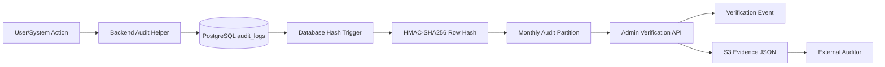

# Client Audit Report: Audit Log Integrity Controls
## Audit Log Partitioning, Hash Chain, and Verification Controls

## 1. Executive Summary

The audit log system has been upgraded to make audit records tamper-evident, easier to review, and easier to prove to an external auditor.

In simple terms:

| Before | Now |
| --- | --- |
| Audit events were stored as normal database rows. | Audit events are stored in a cryptographic hash chain. |
| Logs were in one standard table. | Logs are organized into monthly PostgreSQL partitions. |
| Verification was manual and database-focused. | Admins can run an audit verification API. |
| Audit evidence stayed only in the database. | Verification reports are exported to S3 as JSON evidence. |

The system can now prove whether the active audit log chain is intact. If someone silently changes audit data, the verification API detects the mismatch.

## 2. Basic Architecture



What each layer does:

| Layer | Purpose |
| --- | --- |
| Backend | Captures audit events with user, project, IP, entity, and event details. |
| PostgreSQL | Assigns audit sequence numbers and computes hashes inside the database. |
| Monthly partitions | Store audit logs by month for cleaner audit-period management. |
| Verification API | Recomputes and validates the full hash chain. |
| S3 evidence | Stores the verification response outside the database. |

## 3. What Was Implemented

| Control | What it means for the client |
| --- | --- |
| Hash chain | Every audit row is linked to the previous audit row. |
| HMAC-SHA256 | Audit row hashes are cryptographically generated using `DB_SECRET`. |
| Database trigger | The database generates `row_hash`; application users cannot provide it. |
| Monthly partitioning | Logs are grouped by audit month. |
| Closed-month insert block | The database rejects inserts into previous months. |
| Startup checkpoint | The app logs the latest audit hash during startup. |
| Admin-only verification API | Only globally authorized users can run audit verification. |
| Self-audited verification | Running the verification API writes a verification event into audit logs. |
| S3 report export | The final verification response is stored as external JSON evidence. |

## 4. How We Prove Audit Logs Are Protected

The proof is not based on trust in the application. The proof comes from recomputing the audit chain from the database data.

Each row contains:

| Field | Why it matters |
| --- | --- |
| `chain_seq` | Defines the exact audit order. |
| `row_hash` | Proves the row content has not changed. |
| Previous row hash inside the payload | Links each row to the row before it. |

Because each row hash includes the previous row hash, changing one historical row breaks the chain.

Example:

```text
Row 1 hash -> Row 2 hash -> Row 3 hash -> Row 4 hash
```

If Row 2 is changed, Row 2 no longer matches its stored hash. Since Row 3 depends on Row 2's hash, the chain is no longer valid.

## 5. External Auditor Evidence Package

An external auditor can ask for the latest output from:

```http
GET /v2/audit/verify-hash-chain
```

The response gives the evidence needed to support audit-log integrity:

| Evidence | What the auditor checks |
| --- | --- |
| `success = true` | No verification issues were found. |
| `audit_ready = true` | The system considers the audit log ready for audit review. |
| `missing_hash_count = 0` | Every audit row has a hash. |
| `broken_hash_count = 0` | Every audit hash matches recomputation. |
| `chain_seq_unique = true` | No duplicate audit sequence numbers exist. |
| `chain_seq_gapless = true` | No missing audit sequence numbers exist. |
| `first_row_hash` and `first_log_date` | Starting checkpoint for the audit chain. |
| `latest_row_hash` and `latest_log_date` | Latest checkpoint for the audit chain. |
| `verification_event_id` | Proof that the verification itself was audited. |
| `verification_response_s3_key` | Location of the external JSON evidence in S3. |

## 6. Auditor Review Steps

Recommended auditor flow:

1. Confirm the verifier is an authorized admin/global-read user.
2. Run `GET /v2/audit/verify-hash-chain`.
3. Confirm `success = true`.
4. Confirm `broken_hash_count = 0`.
5. Confirm `missing_hash_count = 0`.
6. Confirm the sequence has no duplicates or gaps.
7. Record the first and latest hash/date checkpoints.
8. Confirm a `verification_event_id` was written.
9. Retrieve the JSON report from `verification_response_s3_key`.
10. Retain the S3 JSON report as external audit evidence.

## 7. What This Proves

This proves the active audit log is tamper-evident.

| Claim | Evidence |
| --- | --- |
| Audit rows were not silently modified. | Hash recomputation returns `broken_hash_count = 0`. |
| Audit rows are ordered. | `chain_seq` is unique and gapless. |
| Hashes are generated by the database. | Trigger/function checks pass. |
| Backdated prior-month inserts are blocked. | Closed-month insert guard exists in the database trigger. |
| The verification was independently retained. | S3 JSON evidence key is returned. |

## 8. Important Note on Immutability

The current system provides strong tamper evidence and blocks inserts into closed months.

That means:

| Area | Status |
| --- | --- |
| Silent data change detection | Implemented. |
| Prior-month backdated insert blocking | Implemented. |
| External verification evidence in S3 | Implemented. |
| Explicit database-level `UPDATE` / `DELETE` blocking | Recommended next hardening step. |
| Immutable S3 retention, such as Object Lock | Recommended next hardening step. |

So the accurate client statement is:

> The audit logs are tamper-evident and protected against closed-period backdated inserts. Any silent change to active audit data is detected by the verification API. For strict write-once immutability, update/delete blocking and immutable S3 retention should be added as the next control layer.

## 9. Final Client Summary

The audit log platform now has the key controls expected for audit readiness:

- Cryptographic hash chaining
- Database-side hash generation
- Monthly audit partitions
- Closed-period insert protection
- Admin-only verification API
- Self-audited verification events
- S3 evidence export

This gives the client a practical, repeatable way to prove audit log integrity to an external auditor.
