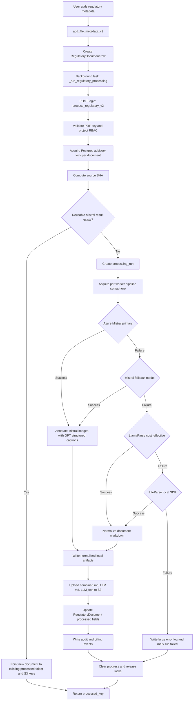
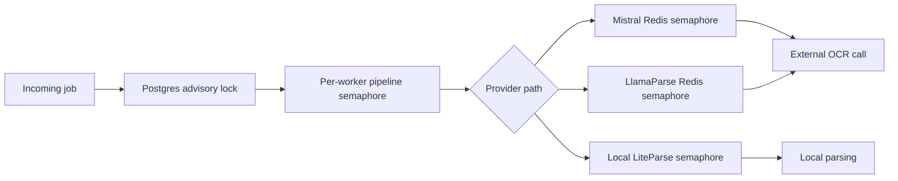

# Regulatory (PI) Parsing Pipeline

This document explains the new Regulatory document parsing pipeline added for PI uploads. It is written for engineers, reviewers, project managers, and client stakeholders who need to understand what happens when a regulatory PDF is processed.

## Executive Summary

The pipeline converts an uploaded Regulatory (PI) PDF into downstream-ready markdown and JSON for RAG indexing and review workflows. It is designed around production concerns: idempotency, concurrency control, provider fallbacks, persistent S3 outputs, auditability, and graceful failure logging.

The preferred provider is Azure-hosted Mistral OCR through the official Mistral SDK. If that path fails, the system falls back in order to a configured Mistral fallback model, LlamaParse cost-effective parsing, and finally LiteParse local parsing.

## End-To-End Flow



## Main Files

- `label/routes/files.py`: regulatory uploads now enqueue `_run_regulatory_processing` in the background.
- `label/routes/processing.py`: owns `/process/process-regulatory`, project validation, document-level locking, idempotent reuse, run records, S3 upload, audit, billing, and failure handling.
- `label/processors/regulatory_pipeline.py`: owns provider execution, provider fallback order, Mistral chunking, image captioning, output normalization, and local artifact writing.
- `label/utils/llm_factory.py`: owns singleton client/agent factories per worker process.
- `label/processors/prompt_templates/regulatory_image_caption.py`: owns the image caption structured-output schema and system prompt.

## Output Contract

The new pipeline intentionally writes into the existing downstream-compatible location:

```text
Processed/<folder_stem>/<stem>_combined.md
Processed/<folder_stem>/<stem>_LLM.md
Processed/<folder_stem>/<stem>_LLM.json
Processed/<folder_stem>/<stem>_parsed.json
Processed/<folder_stem>/<stem>.sha256
Processed/<folder_stem>/raw.json
Processed/<folder_stem>/raw_json/<provider>/...
```

Three files are uploaded to S3:

- `<stem>_combined.md`: markdown with inline base64 image data for Mistral outputs.
- `<stem>_LLM.md`: markdown without image data; images are represented by concise captions.
- `<stem>_LLM.json`: structured page text for downstream consumers.

The `RegulatoryDocument` row uses the existing downstream fields:

- `processed_bbox_key`
- `processed_bbox_s3_keys`
- `structured_json_key`
- `firstpage`

No database migration is required for the current implementation.

## Provider Fallbacks

### 1. Azure Mistral SDK

Mistral is the primary provider because it returns page-level markdown and image crops with base64 data. The Azure endpoint is special and must use the official Mistral SDK with the Azure `server_url` and API version parameter.

Important behavior:

- The PDF is split with `make_chunks` using `MAX_PAGES_PER_CHUNK` because Azure Mistral has a 30-page limit.
- Each chunk call uses `include_image_base64=True` and `include_blocks=None`.
- Page indexes are converted from chunk-local to document-global.
- Mistral image crops are sent to a lightweight GPT structured-output agent for captions.
- Mistral outputs are eligible for idempotent reuse.

### 2. Mistral Fallback Model

If `MISTRAL_MODEL_FALLBACK` is configured and Mistral primary fails, the same SDK/chunking path is retried using the fallback model. This path is also Mistral, so successful results remain eligible for idempotent reuse.

### 3. LlamaParse Cost-Effective

LlamaParse is used with `tier="cost_effective"` and `version="latest"`. It runs on the original PDF, without chunking. This provider gives high-quality markdown, but does not follow the Mistral image/caption path and is not reused by the Mistral idempotency rule.

### 4. LiteParse Local SDK

LiteParse is the final fallback. It runs locally through the Python SDK, not the CLI. It provides a last-resort path that keeps the pipeline from failing completely when external providers are unavailable.

## Progress Reporting

Regulatory OCR progress is written to Redis through `label/utils/processing_progress.py` using the `regulatory_documents` progress kind and the regulatory document ID. The `/rag/process-all-embedding-projectid` API reads this value in `_collect_project_embedding_status_sync` and returns it on each in-progress regulatory item.

Progress behavior is provider-specific:

- Mistral primary and fallback reset progress to `0` when each Mistral attempt starts, then update incrementally after each processed PDF chunk using completed pages over total pages.
- LlamaParse has no chunk-level callback in the current SDK path, so it reports a hardcoded `50%` marker when the LlamaParse fallback starts.
- LiteParse reports a hardcoded `80%` marker when the LiteParse fallback starts.

The processing route clears the Redis progress key when the request finishes or fails. Once `processed_bbox_key` is stored on the `RegulatoryDocument`, the document stops appearing as an OCR in-progress item and becomes eligible for indexing.

## Idempotency Rules

The new route performs idempotent reuse only for completed Mistral regulatory outputs. It checks the current document first, so repeated clicks on the process button return the existing processed folder instead of running OCR again.

A result is reusable only when all of these are true:

- For same-document reuse, the current document already has completed Mistral processed metadata.
- For duplicate-document reuse, the source SHA matches another recent document within `MISTRAL_IDEMPOTENT_BBOX_REUSE_DAYS`.
- The reusable row has `processed_bbox_s3_keys`, `structured_json_key`, and `firstpage`.
- The reusable row has `processed_bbox_key`, so the new document can point to the same processed folder.
- `processed_bbox_s3_keys.provider == "mistral"`.
- The S3 metadata contains `combined_md`, `llm_md`, and `llm_json`.

When reuse succeeds, the new document points to the same processed folder and S3 keys. No provider call is made and no S3 re-upload occurs.

This is intentionally stricter than the old bbox helper. It prevents the new pipeline from accidentally reusing legacy outputs or fallback-provider outputs with different quality and image-caption semantics.

## Locking And Queues

The pipeline has several layers of concurrency control.



### Document Lock

`PostgresAdvisoryLock("regulatory-processing-document", "<project_id>:<document_id_or_key>")` prevents two workers from processing the same document at the same time.

### Per-Worker Pipeline Queue

`REGULATORY_PIPELINE_WORKER_LIMIT=2` means two full regulatory pipelines can run per Uvicorn worker process. With 4 Uvicorn workers, one backend container can run up to 8 full regulatory pipelines concurrently. Extra background jobs wait in the worker that accepted them.

This queue is implemented as an async semaphore, so waiting jobs do not block the event loop.

### Provider Global Limits

Redis semaphores limit provider calls across workers and containers:

- `MISTRAL_GLOBAL_LIMIT` controls Mistral OCR calls.
- `LLAMAPARSE_GLOBAL_LIMIT` controls LlamaParse calls.
- Redis leases have heartbeats, so a crashed process eventually releases its slot.

This distinction matters: worker limits protect app CPU/memory; Redis limits protect external providers and shared quotas.

### Current Locks, Semaphores, And Limits

| Control | Type | Scope | Default / Setting | Applies To | Behavior |
| --- | --- | --- | --- | --- | --- |
| `PostgresAdvisoryLock("regulatory-processing-document", "<project_id>:<document_id_or_key>")` | PostgreSQL advisory lock | Global across workers and containers sharing Postgres | One lock per project/document | Full `/process/process-regulatory` request | Rejects a duplicate concurrent run for the same document with HTTP 409. |
| `REGULATORY_PIPELINE_SEMAPHORE` | `asyncio.Semaphore` | One Uvicorn worker process | `REGULATORY_PIPELINE_WORKER_LIMIT`, default `2` | Full provider cascade and output writing | Queues full regulatory pipelines inside each worker. With 4 workers and value `2`, one container runs up to 8 full pipelines. |
| `redis_semaphore("mistral-regulatory-ocr")` | Redis lease semaphore | Global across workers and containers sharing Redis | `MISTRAL_GLOBAL_LIMIT`, default from app settings | Each Mistral OCR chunk call | Limits concurrent Azure Mistral OCR calls across the deployment. |
| `MISTRAL_REGULATORY_SEMAPHORE` | `threading.BoundedSemaphore` | One Uvicorn worker process | Hard-coded `2` | Each Mistral OCR chunk call | Adds local per-worker pressure control around Mistral SDK calls. |
| `redis_semaphore("llamaparse-regulatory-ocr")` | Redis lease semaphore | Global across workers and containers sharing Redis | `LLAMAPARSE_GLOBAL_LIMIT`, default `1` | Each LlamaParse document parse call | Limits concurrent LlamaParse calls across the deployment. |
| `LLAMAPARSE_REGULATORY_SEMAPHORE` | `threading.BoundedSemaphore` | One Uvicorn worker process | Hard-coded `1` | Each LlamaParse document parse call | Ensures each worker sends at most one LlamaParse regulatory job at a time. |
| `LITEPARSE_REGULATORY_SEMAPHORE` | `threading.BoundedSemaphore` | One Uvicorn worker process | Hard-coded `1` | LiteParse local parse call | Prevents multiple local LiteParse regulatory parses inside one worker. |
| `redis_semaphore("word-conversion")` | Redis lease semaphore | Global across workers and containers sharing Redis | `WORD_CONVERSION_GLOBAL_LIMIT` | Word-to-PDF conversion before regulatory metadata processing | Prevents concurrent LibreOffice/AbiWord conversion bursts across the deployment. |
| `_CONVERSION_SEMAPHORE` | `threading.BoundedSemaphore` | One Uvicorn worker process | `MAX_CONCURRENT_CONVERSIONS = 1` | Word-to-PDF conversion before regulatory metadata processing | Queues local converter work inside one worker. |
| `_CONVERSION_EXECUTOR` | `ProcessPoolExecutor` | One Uvicorn worker process | `max_workers=1` | Word-to-PDF conversion child process isolation | Runs one converter process per worker for isolation and CPU/memory control. |
| Redis semaphore lease | Redis lease heartbeat | Global for Redis semaphore users | `REDIS_SEMAPHORE_LEASE_SECONDS`, default `300` | Mistral, LlamaParse, word conversion | Prevents permanent slot loss if a worker dies. |
| Redis semaphore wait timeout | Redis wait timeout | Global for Redis semaphore users | `REDIS_SEMAPHORE_WAIT_TIMEOUT_SECONDS`, default `2400` | Mistral, LlamaParse, word conversion | Bounds how long a job waits for a provider/conversion slot before failing. |
| Mistral chunk size | Provider page limit guard | Per Mistral provider call | `MAX_PAGES_PER_CHUNK`, default `30` | Azure Mistral primary and fallback OCR | Keeps each Mistral OCR request within the provider page limit. |
| Upload page cap | API validation limit | Per uploaded file | `MAX_UPLOAD_PAGES = 500` | Upload before regulatory processing | Rejects oversized files before they enter the pipeline. |

## Singleton Clients Per Worker

The provider clients and agents are created with `@lru_cache` in `label/utils/llm_factory.py`.

That means each Uvicorn worker process creates and reuses one instance of each factory result:

- Azure Mistral SDK client.
- LlamaCloud client.
- LiteParse parser.
- GPT image annotation model.
- GPT image annotation agent.

Because Uvicorn workers are separate processes, `@lru_cache` is per worker, not global across the whole deployment. With 4 workers, there can be 4 cached Mistral clients and 4 cached LlamaCloud clients in one container.

Benefits:

- Avoid repeated SDK/client construction overhead.
- Keep configuration centralized.
- Preserve per-worker isolation.
- Work naturally with multi-process Uvicorn deployments.

## Failure Handling

Each provider failure is recorded in the attempt list and logged before the next fallback runs. If all providers fail:

- The processing run is marked `failed`.
- An audit event is inserted.
- A visually obvious error block is written to normal logs.
- Detailed JSON is appended to `data/logs/error.log` with project ID, document ID, key, provider attempts, error type, error text, and traceback.

## Scalability Notes

The design supports very high monthly or weekly page volume by separating work into bounded queues and fallback stages.

Key scaling properties:

- Horizontal app scaling is supported because document-level locks are in Postgres and provider concurrency is in Redis.
- Per-worker pipeline limits prevent one process from overloading CPU/RAM with too many PDFs at once.
- Mistral chunking keeps Azure calls under the provider page limit.
- Idempotent Mistral reuse avoids reprocessing duplicate regulatory documents and avoids duplicate S3 uploads.
- S3 is the persistent artifact store; local filesystem paths are working/output cache for the app.
- Provider failures degrade through fallbacks instead of stopping the entire workflow at the first service issue.

For example, with 4 Uvicorn workers and `REGULATORY_PIPELINE_WORKER_LIMIT=2`, one container runs up to 8 full regulatory pipelines concurrently. With multiple containers, total pipeline capacity scales by container count, while `MISTRAL_GLOBAL_LIMIT` and `LLAMAPARSE_GLOBAL_LIMIT` still enforce global provider safety.

## Operational Settings

```text
USE_MISTRAL_FOR_REGULATORY_PIPELINE=true
AZURE_MISTRAL_OCR_ENDPOINT=https://ecs-genai-label-update.services.ai.azure.com/providers/mistral/azure/ocr#
MISTRAL_MODEL=mistral-document-ai-2512
MISTRAL_MODEL_FALLBACK=<optional>
MISTRAL_GLOBAL_LIMIT=4
MISTRAL_IDEMPOTENT_BBOX_REUSE_DAYS=15
MAX_PAGES_PER_CHUNK=30
LLAMA_CLOUD_API_KEY=<secret>
LLAMAPARSE_GLOBAL_LIMIT=1
REGULATORY_PIPELINE_WORKER_LIMIT=2
REGULATORY_MISTRAL_IMAGE_ANNOTATION_OPENAI_MODEL=gpt-5-mini
REDIS_SEMAPHORE_LEASE_SECONDS=300
REDIS_SEMAPHORE_WAIT_TIMEOUT_SECONDS=2400
```

## Review Checklist

- Regulatory upload uses the new background helper, while old code remains available.
- API-level RBAC is enforced before processing.
- Same-document duplicate execution is blocked by Postgres advisory lock.
- Full-pipeline concurrency is queued per worker.
- External provider concurrency is globally controlled by Redis semaphores.
- Mistral duplicate reuse is strict and avoids S3 re-upload.
- Fallback outputs preserve the same downstream markdown/JSON contract.
- Final failure logs go to both normal logs and `data/logs/error.log`.
