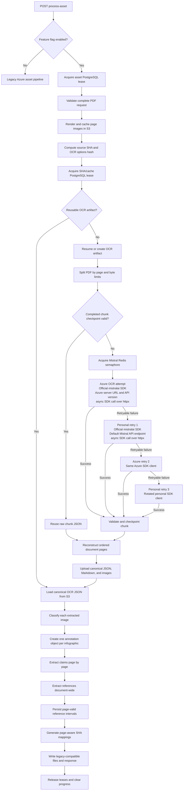
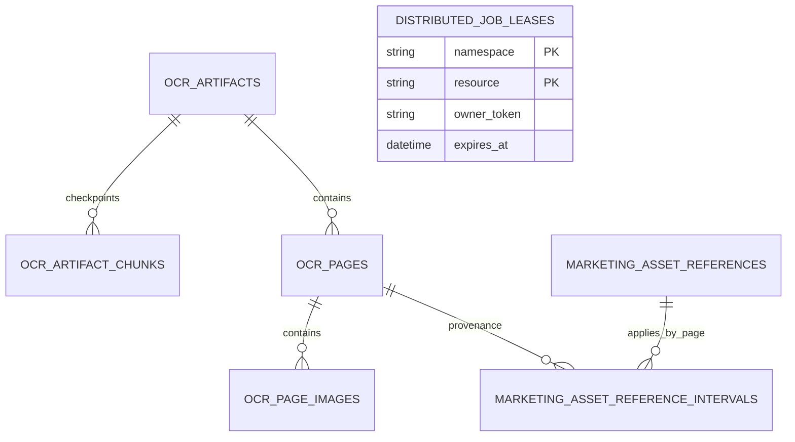

# Marketing Asset Pipeline Results

## Recheck Status

- `12` offline tests pass.
- All touched Python files have no reported diagnostics.
- `label/` and `tests/` compile successfully.
- Alembic has one head: `d7e8f9a0b1c2`.
- The feature flag remains disabled by default: `USE_MISTRAL_ASSET_PIPELINE=false`.
- No frontend files or public request/response models were changed.
- Live PostgreSQL, Redis, S3, Azure Mistral, personal Mistral, and Azure OpenAI calls were not executed during offline validation.

## Implementation In 15 Points

1. The existing `POST /v2/process/process-asset` endpoint remains the public entry point. The feature flag selects the new Mistral/LangChain implementation; otherwise the legacy Azure implementation runs unchanged.

2. The new route acquires an expiring PostgreSQL asset lease keyed by project and asset. A concurrent request for the same asset receives HTTP `409` instead of starting duplicate work.

3. The OCR layer also acquires an expiring SHA/cache-identity lease. This prevents two different asset records containing the same PDF from issuing duplicate Mistral OCR work concurrently.

4. The PDF is validated and split into contiguous chunks using both page-count and upload-byte limits. A single page that exceeds the byte limit fails explicitly rather than being silently skipped.

5. Every chunk follows the configured provider sequence: initial Azure, first retry personal, second retry Azure, and third retry personal. Personal keys are selected by Redis rotation, and only the key slot number is persisted.

6. Mistral OCR concurrency is controlled independently through a Redis semaphore. Semaphore acquisition is performed in a worker thread so its polling does not block the asyncio event loop.

7. Each chunk response is validated for page count, unique local indexes, dimensions, and ordered blocks. Invalid OCR responses participate in provider fallback instead of being accepted as successful output.

8. Successful raw Mistral responses, including confidence scores and image base64 values, are stored in S3. Chunk status and attempt metadata are checkpointed in PostgreSQL.

9. A failed run can resume completed chunks from S3. If a completed checkpoint is missing or malformed, it is marked failed and rerun instead of aborting the entire resume operation.

10. Canonical OCR JSON removes confidence scores and embedded image base64. Extracted images are uploaded separately to S3, while page JSON, ordered blocks, combined Markdown, and coordinate-free LLM Markdown are persisted as reusable OCR artifacts.

11. OCR artifacts are reusable for the configured period when the source SHA, provider family, OCR options hash, and pipeline version match. A partial unique index ensures only one active artifact exists for one cache identity.

12. Every extracted image is classified through a LangChain structured-output agent. Infographics receive one annotation object containing `visible_text` and `description`; product images, logos, and decorative images are classified as `other` and contribute no annotation text.

13. Claims are extracted page by page through a LangChain structured-output agent using the full page image plus ordered OCR context blocks. Reference blocks are removed from claim context, and valid claims without superscripts are retained with an empty superscript list.

14. Reference blocks are interpreted document-wide through LangChain, matched only against the project regulatory-document catalog, and persisted with page-valid intervals. Each superscript carries forward independently, and multiple references can share one superscript and interval.

15. SHA-list generation now resolves reference mappings against each claim's page. Existing output keys remain unchanged: `sha256_list`, `s3_key`, and `warning`. The route also keeps the existing Markdown/claims files and audit, billing, progress, and response contracts.

## End-To-End Flow



### OCR SDK And HTTP Transport

Both Azure-hosted Mistral OCR and personal Mistral OCR use the official `mistralai` Python SDK. The application does not construct direct `requests` or `httpx` OCR calls in the new marketing asset pipeline.

| Provider path | Client construction | Endpoint | Model | Invocation |
| --- | --- | --- | --- | --- |
| Azure initial attempt and retry 2 | `Mistral(api_key=MISTRAL_KEY, server_url=AZURE_MISTRAL_OCR_ENDPOINT)` | Configured Azure Mistral OCR server URL with SDK query parameter `api-version=2024-05-01-preview` | `MISTRAL_MODEL_FOR_ASSET` | `await client.ocr.process_async(...)` |
| Personal retry 1 and retry 3 | `Mistral(api_key=PERSONAL_MISTAL_AI_KEY*)` | Default Mistral API endpoint selected by the SDK | `mistral-ocr-latest` | `await client.ocr.process_async(...)` |

The same `_call_provider` function is used for both provider types. It sends the PDF chunk as a base64 `data:application/pdf` document URL and requests image base64, headers, footers, word confidence scores, and ordered blocks.

At the application-code level, the integration is an SDK integration, not a hand-written HTTP integration. Internally, the installed `mistralai==2.6.0` SDK creates an `httpx.AsyncClient` when an async client is not supplied. Because this pipeline calls `process_async`, the network request is ultimately sent through that SDK-managed `httpx.AsyncClient`. The SDK also constructs a synchronous `httpx.Client`, but the new OCR execution path does not call the synchronous OCR method.

Personal-key rotation occurs before the SDK call. Redis selects a configured personal client slot, but Redis does not make the OCR request and no API key value is persisted in Redis or PostgreSQL.

The downstream image annotation, claim extraction, and reference extraction stages are separate from Mistral OCR. They use LangChain agents and `langchain-openai` model wrappers; the new derived-extraction code does not call the OpenAI SDK directly.

## Why `PostgresJobLease` Was Added

`PostgresJobLease` is not the marketing-asset progress tracker. Processing progress still uses Redis through `utils/processing_progress.py`. The `distributed_job_leases` table stores temporary ownership records only:

- `namespace` and `resource`: the protected job identity.
- `owner_token`: identifies the worker that owns the lease.
- `heartbeat_at` and `expires_at`: allow ownership to expire after a worker crash.
- `metadata`: operational context such as asset/project identity.

`PostgresAdvisoryLock` would correctly prevent concurrent asset processing while its database connection remains alive. It is simpler and is still used by the legacy path. The expiring lease was selected for the new long-running pipeline because it provides these additional properties:

| Concern | Advisory lock | Expiring job lease |
| --- | --- | --- |
| Requires a dedicated database connection for the whole job | Yes | No |
| Automatically released when connection dies | Yes | Lease expires after heartbeat stops |
| Visible/queryable ownership and expiry | Limited | Yes |
| Token-checked renewal and release | No explicit token | Yes |
| Can detect lost ownership between stages | Indirectly | `ensure_owned()` |
| Suitable for resumable work lasting many provider calls | Possible | Explicitly designed for it |

So the table is partly a robust failure-handling mechanism, not merely an `in progress` boolean. It prevents a dead worker from blocking the asset forever, avoids pinning one PostgreSQL connection during OCR and GPT calls, and gives the pipeline a way to detect lost ownership. The tradeoff is additional schema and heartbeat complexity. If connection pinning is acceptable and operational visibility is unnecessary, `PostgresAdvisoryLock` would be a valid simpler design for the per-asset lock.

The SHA-level lock is a stronger reason for the lease: it coordinates identical PDFs across different assets and protects the shared reusable OCR artifact. The partial unique index on active artifacts is an additional database invariant, not a replacement for the work lease.

## Image-To-Claim Semantics

The current implementation does the following:

1. Mistral returns each extracted image as one image object.
2. The image is uploaded separately to S3.
3. One LangChain image-annotation call produces one annotation object for that image.
4. For an infographic, `visible_text` and `description` are joined into one image context block.
5. That block is passed with the other page blocks to the page-level claim extraction agent.

However, the current implementation does **not** strictly guarantee that all content from one infographic becomes exactly one claim. The prompt says to keep visually grouped infographic callouts together when they form one claim, but the structured output is still a page-level `sentences[]` array. The model may therefore produce zero, one, or multiple claims from one image annotation.

To enforce the requested invariant, the next implementation should preserve image provenance through claim extraction, for example:

```json
{
  "source_type": "image",
  "source_id": "img-1.png",
  "content": "<complete visible text and description for the image>"
}
```

Then either:

- extract one claim object per infographic before the general page claims, or
- require each claim to include `source_block_ids` and post-process all claims from the same image block into one combined claim.

The first option is simpler and gives the strongest guarantee: one infographic object in, at most one infographic claim out.

## Additional Tables In `label/DAL/models/tables.py`

Six new tables were created for the marketing asset pipeline. They are separated because they represent different lifecycles: a reusable document-level OCR result, retryable chunk-level work, page-level content, image-level annotations, page-aware reference rules, and temporary distributed lock ownership.



### 1. `ocr_artifacts`

**Reason:** This is the document-level identity and manifest for one OCR result. It answers: "Have we already OCR-processed these exact PDF bytes with these exact OCR options and pipeline version?"

The source SHA alone is insufficient because the same PDF may produce different output when the provider family, model options, or pipeline version changes. The reusable identity is therefore based on:

- `source_sha256`
- `provider_family`
- `options_hash`
- `pipeline_version`

The table also stores the overall state (`started`, `complete`, or `failed`), the S3 locations of canonical JSON and Markdown outputs, page/byte counts, completion time, and `reusable_until`.

**How it is used:**

- Before OCR, the pipeline looks for a matching complete and unexpired artifact.
- If found, it reuses canonical S3 output and avoids another Mistral request.
- If a matching started or failed artifact exists, the pipeline resumes it.
- A marketing asset links to the artifact through `marketing_assets.ocr_artifact_id`.
- A partial unique index prevents two active artifacts for the same cache identity.

**Why this is a separate table:** An OCR artifact can be shared by different marketing assets that contain identical PDF bytes. Storing all OCR state directly on `marketing_assets` would duplicate data and prevent cross-asset reuse.

**Without it:** Every request would rerun OCR, there would be no stable parent for chunks/pages/images, and it would be difficult to distinguish results produced by different pipeline versions or OCR settings.

### 2. `ocr_artifact_chunks`

**Reason:** Mistral OCR is performed on bounded PDF chunks rather than necessarily on the entire PDF in one request. This table records the execution and checkpoint state for every chunk.

Each row stores:

- Chunk index and page range.
- Chunk SHA and byte size.
- Current status and attempt count.
- Successful or last-attempt provider and model.
- Personal key slot number, never the key value.
- Last error and complete attempt history metadata.
- S3 key for the raw successful Mistral response.

**How it is used:** A row is upserted as an attempt starts, fails, retries, or completes. On a later run, complete chunks are loaded from their raw S3 checkpoints. If a supposedly complete checkpoint is missing or malformed, its row is changed to failed and that chunk is rerun.

**Why this is a separate table:** Chunk execution has a one-to-many relationship with the document artifact and a different lifecycle. One chunk may fail while others are complete. Putting chunk state into one JSON field on `ocr_artifacts` would make concurrent updates, indexed queries, resumability, and failure diagnosis less reliable.

**Without it:** A failure near the end of a large PDF would require OCR-processing the whole PDF again, and there would be no durable provider-attempt audit per chunk.

### 3. `ocr_pages`

**Reason:** This table is the normalized page-level view of the canonical OCR artifact. It gives every page a stable database identity and stores the page content needed by downstream stages.

Each row contains:

- Artifact and page number.
- Markdown, header, and footer.
- Page dimensions and ordered OCR blocks.
- S3 key for that page's canonical JSON.
- S3 key for the rendered full-page image.
- Content SHA and metadata.

**How it is used:** Claim extraction loads pages in page-number order, passes page blocks and the full-page image to LangChain, and links each stored claim response to `ocr_page_id`. Reference intervals can also retain the OCR page that declared the reference.

**Why this is a separate table:** Page content is independently addressable and is consumed page by page. It also acts as the parent for extracted images. Keeping pages only inside the document-level canonical JSON would make relational provenance and page-specific joins unavailable.

**Without it:** The pipeline could still read canonical JSON from S3, but database records could not reliably point to the exact OCR page that produced a claim, image annotation, or reference declaration.

### 4. `ocr_page_images`

**Reason:** A Mistral page may contain zero or many extracted images, and every image has independent storage, classification, annotation, and failure state.

Each row stores:

- Parent OCR page and Mistral image ID.
- Bounding box and image-content SHA.
- S3 key for the extracted image bytes.
- Classification such as `infographic`, `other`, or `unknown`.
- Annotation status and structured annotation JSON.
- Annotation provider, model, prompt version, and error metadata.

**How it is used:** OCR first creates the image rows after removing base64 from canonical JSON and uploading the bytes to S3. The LangChain image stage then updates each row independently with its classification and annotation result.

**Why this is a separate table:** Image annotation is a derived stage that can be retried or versioned independently of OCR. An image may fail annotation without invalidating the page or document OCR result. Storing all annotations in `ocr_pages.blocks` would mix raw OCR with mutable derived data and make individual image status difficult to query.

**Without it:** Image annotation results would exist only inside transient in-memory canonical data. There would be no durable per-image provenance, retry status, provider/model record, or direct S3 lookup.

**Current limitation:** This table preserves one image as one object, but claim extraction does not currently preserve `ocr_page_images.id` on each generated claim. Therefore it does not yet enforce one infographic image to exactly one claim.

### 5. `marketing_asset_reference_intervals`

**Reason:** Existing `marketing_asset_references` rows describe which regulatory document a superscript points to, but they do not describe the pages on which that mapping is valid. This new table adds the missing page-wise validity rule.

Each row stores:

- Marketing asset, project, and superscript serial number (`s_no`).
- The existing `marketing_asset_references` row being applied.
- Page on which the reference was declared.
- Inclusive `valid_from_page` and `valid_to_page` bounds.
- Optional source OCR page and source block index for provenance.

**How it is used:** Reference extraction builds intervals independently for each superscript. SHA-list generation joins these intervals and selects only references whose bounds contain the claim's page number. Multiple reference rows may share the same serial number and interval when one superscript maps to multiple documents.

**Why this is a separate table:** The existing reference table remains the stable document mapping and toggle record. Page validity is a separate, potentially repeated relationship: one reference can have page scope, and one superscript interval can contain multiple references. Keeping this separate also preserves legacy reference rows that have no interval and should remain document-wide.

**Without it:** Reference mapping would be document-wide. If superscript `1` changes meaning on a later page, claims from earlier and later pages could receive the wrong regulatory-document SHA and S3 key.

### 6. `distributed_job_leases`

**Reason:** This table implements an expiring PostgreSQL distributed mutex for long-running asset and shared-artifact work. It is not the progress table and does not store OCR output.

The composite primary key, `namespace` plus `resource`, identifies the protected operation. Other columns store the current worker's random `owner_token`, acquisition and heartbeat times, expiry, and diagnostic metadata.

**How it is used:** Acquisition performs an atomic insert or takes over an existing row only after expiry. A heartbeat extends the lease. Renewal and deletion require the same owner token, which prevents an old worker from renewing or deleting a newer worker's lease. The route checks ownership between major stages.

The pipeline currently uses two resource scopes:

- Asset scope: prevents simultaneous processing of the same project/asset.
- Artifact scope: prevents identical PDF bytes and OCR options from starting duplicate shared OCR work across different assets.

**Why this is a separate table:** Lease rows are short-lived coordination records with atomic takeover rules. They are unrelated to the permanent marketing-asset, OCR-result, or processing-progress records. Mixing lease ownership into a business table would add stale-lock fields and race-prone conditional updates to permanent data.

**Without it:** The new path could use `PostgresAdvisoryLock`, but it would need to hold one database connection for the entire OCR and LangChain run and would not expose explicit expiry, heartbeat, owner-token checks, or queryable ownership metadata.

## Existing Tables That Were Extended

These are not new tables, but they received columns so existing business records can point to the new OCR data:

| Existing table | Added data | Reason |
| --- | --- | --- |
| `marketing_assets` | `ocr_artifact_id` | Links an asset to the reusable document-level OCR artifact. |
| `marketing_asset_responses_ids` | `ocr_page_id` | Links a page-level claim extraction response to the exact OCR page used as input. |
| `asset_claim_extractions` | `ocr_artifact_id`, provider, model, prompt version, status | Records which OCR artifact and LangChain extraction configuration produced the claims. |

These foreign-key links provide provenance while preserving the existing endpoint response and existing marketing-asset tables.
